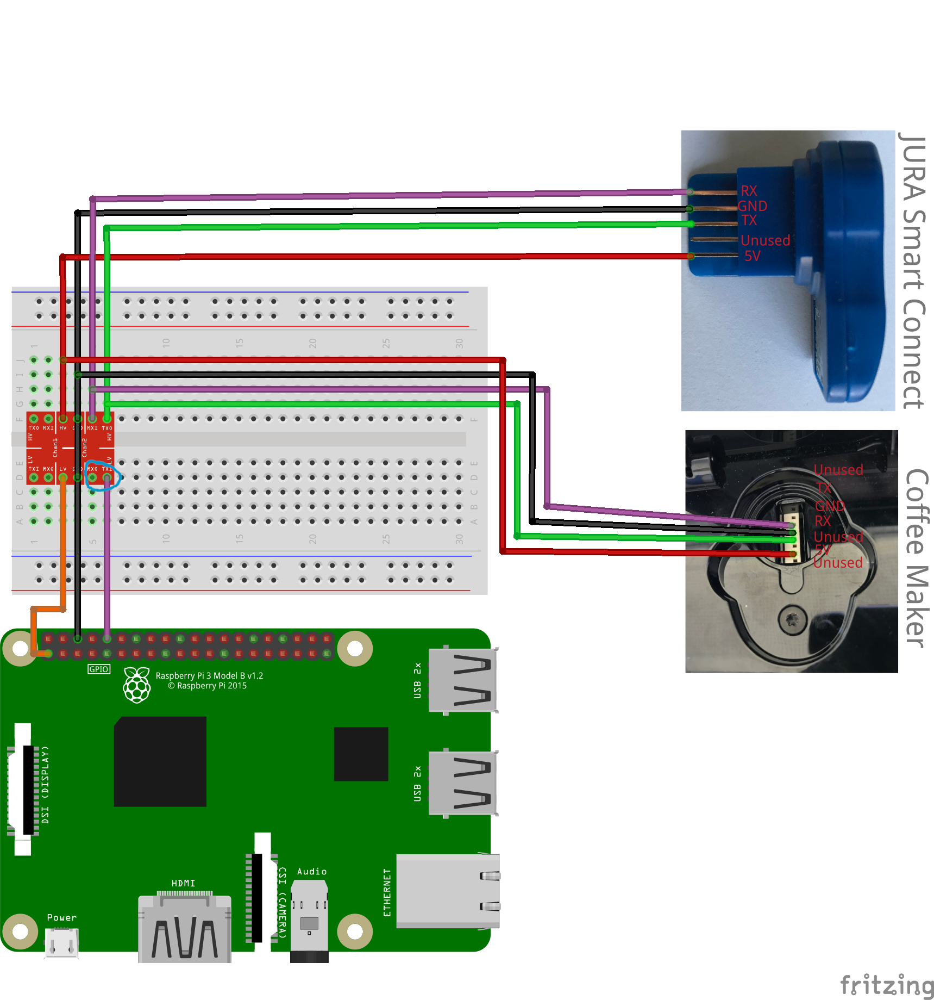

# UI
A `C++20` based implementation to snoop the traffic between an JURA coffee maker and the [Smart Control](https://uk.jura.com/en/homeproducts/accessories/SmartConnect-Main-72167) dongle.
The used protocol for deobfuscating the send data can be found [here](https://github.com/Jutta-Proto/protocol-cpp).

## Requirements
The following requirements are required to build this project.
* A C++20 compatible compiler like [gcc](https://gcc.gnu.org/) or [clang](https://clang.llvm.org/)
* The build system is written using [CMake](https://cmake.org/)
* For managing dependencies in CMake, we are using [conan](https://conan.io/)

### Fedora
To install those dependencies on Fedora, run the following commands:
```bash
sudo dnf install -y gcc clang cmake python3 python3-pip
pip3 install --user conan
```

### Raspberry Pi
To install those dependencies on a Raspberry Pi, running the [Raspberry Pi OS](https://www.raspberrypi.org/software/), run the following commands:
```bash
sudo apt install -y cmake python3 python3-pip
pip3 install --user conan
```
For all the other requirements, head over here: https://github.com/Jutta-Proto/hardware-pi#raspberry-pi-os

## Building
Run the following commands to build this project:
```bash
# Clone the repository:
git clone https://github.com/Jutta-Proto/serial-snooper.git
# Switch into the newly cloned repository:
cd serial-snooper
# Build the project:
mkdir build
cd build
cmake ..
cmake --build .
```

## Hardware
The following image shows you how to connect the coffee maker, Raspberry Pi and the Smart Connect dongle between each other, so you are able to snoop data.



Depending on where you place the purple wire in the blue box (RX0 or TX1), you listen to the traffic from or to the coffee maker.

* **RX0**: Listening to the traffic send **from** the coffee maker.
* **RX0**: Listening to the traffic send **to** the coffee maker.

## Running
Once successfully build, you can run the snooper like follows:
```bash
./src/Jutta-Snooper
```

Once running, it creates the `output` directory containing three files:
* `log.txt`: Basic log with the text that got read.
* `raw.bin`: The binary data, that got read.
* `raw_with_lines.bin`: The binary data, that got read with a `\n` between each line read.

In case the `output` directory already exists, it will be moved to `output_TIME`, where `TIME` is the current time in milliseconds.

## Stopping
To stop the execution press `Ctrl + C` and the snooper should stop.

## License and Copyright Notice 
This piece of software uses the following other libraries and dependencies:

### Catch2 (2.13.4)
Catch2 is mainly a unit testing framework for C++, but it also provides basic micro-benchmarking features, and simple BDD macros.

<details>
  <summary>License</summary>

```
Boost Software License - Version 1.0 - August 17th, 2003

Permission is hereby granted, free of charge, to any person or organization
obtaining a copy of the software and accompanying documentation covered by
this license (the "Software") to use, reproduce, display, distribute,
execute, and transmit the Software, and to prepare derivative works of the
Software, and to permit third-parties to whom the Software is furnished to
do so, all subject to the following:

The copyright notices in the Software and this entire statement, including
the above license grant, this restriction and the following disclaimer,
must be included in all copies of the Software, in whole or in part, and
all derivative works of the Software, unless such copies or derivative
works are solely in the form of machine-executable object code generated by
a source language processor.

THE SOFTWARE IS PROVIDED "AS IS", WITHOUT WARRANTY OF ANY KIND, EXPRESS OR
IMPLIED, INCLUDING BUT NOT LIMITED TO THE WARRANTIES OF MERCHANTABILITY,
FITNESS FOR A PARTICULAR PURPOSE, TITLE AND NON-INFRINGEMENT. IN NO EVENT
SHALL THE COPYRIGHT HOLDERS OR ANYONE DISTRIBUTING THE SOFTWARE BE LIABLE
FOR ANY DAMAGES OR OTHER LIABILITY, WHETHER IN CONTRACT, TORT OR OTHERWISE,
ARISING FROM, OUT OF OR IN CONNECTION WITH THE SOFTWARE OR THE USE OR OTHER
DEALINGS IN THE SOFTWARE.
```

</details>

### spdlog (1.8.5)
Very fast, header-only/compiled, C++ logging library.

<details>
  <summary>License</summary>

```
The MIT License (MIT)

Copyright (c) 2016 Gabi Melman.                                       

Permission is hereby granted, free of charge, to any person obtaining a copy
of this software and associated documentation files (the "Software"), to deal
in the Software without restriction, including without limitation the rights
to use, copy, modify, merge, publish, distribute, sublicense, and/or sell
copies of the Software, and to permit persons to whom the Software is
furnished to do so, subject to the following conditions:

The above copyright notice and this permission notice shall be included in
all copies or substantial portions of the Software.

THE SOFTWARE IS PROVIDED "AS IS", WITHOUT WARRANTY OF ANY KIND, EXPRESS OR
IMPLIED, INCLUDING BUT NOT LIMITED TO THE WARRANTIES OF MERCHANTABILITY,
FITNESS FOR A PARTICULAR PURPOSE AND NONINFRINGEMENT.  IN NO EVENT SHALL THE
AUTHORS OR COPYRIGHT HOLDERS BE LIABLE FOR ANY CLAIM, DAMAGES OR OTHER
LIABILITY, WHETHER IN AN ACTION OF CONTRACT, TORT OR OTHERWISE, ARISING FROM,
OUT OF OR IN CONNECTION WITH THE SOFTWARE OR THE USE OR OTHER DEALINGS IN
THE SOFTWARE.

-- NOTE: Third party dependency used by this software --
This software depends on the fmt lib (MIT License),
and users must comply to its license: https://github.com/fmtlib/fmt/blob/master/LICENSE.rst
```

</details>
